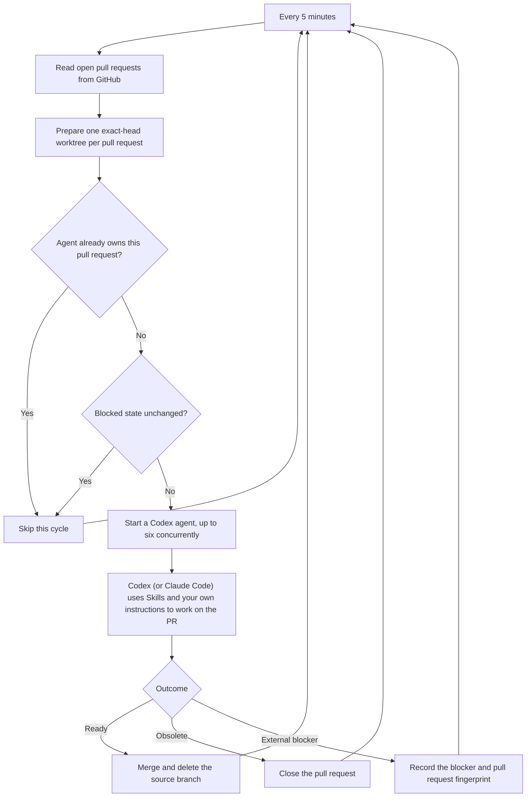

# Babysitter

Babysitter is a [ViteHub](https://github.com/vite-hub/vitehub) agent that owns open pull requests in `vite-hub/vitehub` until each one is merged, closed, or blocked. Every five minutes, it prepares exact-head worktrees and runs up to six Codex agents.

## How it works



1. **Prepare pull requests.** The [schedule](server/babysitter.schedule.ts) reads up to 100 open pull requests from GitHub. The [worktree preparation code](server/utils/reconcile-worktrees.ts) removes worktrees for closed pull requests, fetches each current head, and creates or resets `pr-<number>` to that exact commit. Dependencies are installed when the head changes, so an agent never reviews one revision while editing another.
2. **Give each pull request one owner.** An in-memory lease prevents overlapping agents for the same pull request, while a pool limit allows six different pull requests to move concurrently. Each run receives the pull request metadata and its isolated worktree, and it can run for up to one hour.
3. **Work toward a terminal outcome.** The [agent prompt](server/agents/babysitter/prompt.md) tells Codex to validate the requested direction, bring the branch up to date with its base, address checks and review feedback, verify the exact head, and then merge or close the pull request. The agent may stop only for a real external blocker, such as a missing credential, unavailable service, or unresolved product decision.
4. **Retry only when useful.** A blocked pull request gets a completion fingerprint in ViteHub KV. Later schedules skip it while its observed GitHub state is unchanged; a new commit, comment, check result, review, or metadata change updates the fingerprint and makes it eligible again. Failed, timed-out, or otherwise unfinished runs do not get that completion marker, so a later schedule retries them.

## Run

> [!WARNING]
> Babysitter uses your host and credentials to edit code, push branches, change pull requests, and merge them. Read the [agent prompt](server/agents/babysitter/prompt.md) before running it.

You need Node.js 24, `git`, authenticated [`gh`](https://cli.github.com/) and [`codex`](https://github.com/openai/codex) CLIs, and a clone of `vite-hub/vitehub` at `~/vitehub/vitehub`.

```sh
corepack enable
pnpm install
VITEHUB_WORKTREES_PATH=/path/to/worktrees \
pnpm dev
```

To target another repository, change [`vite.config.ts`](vite.config.ts) and the [agent prompt](server/agents/babysitter/prompt.md).
