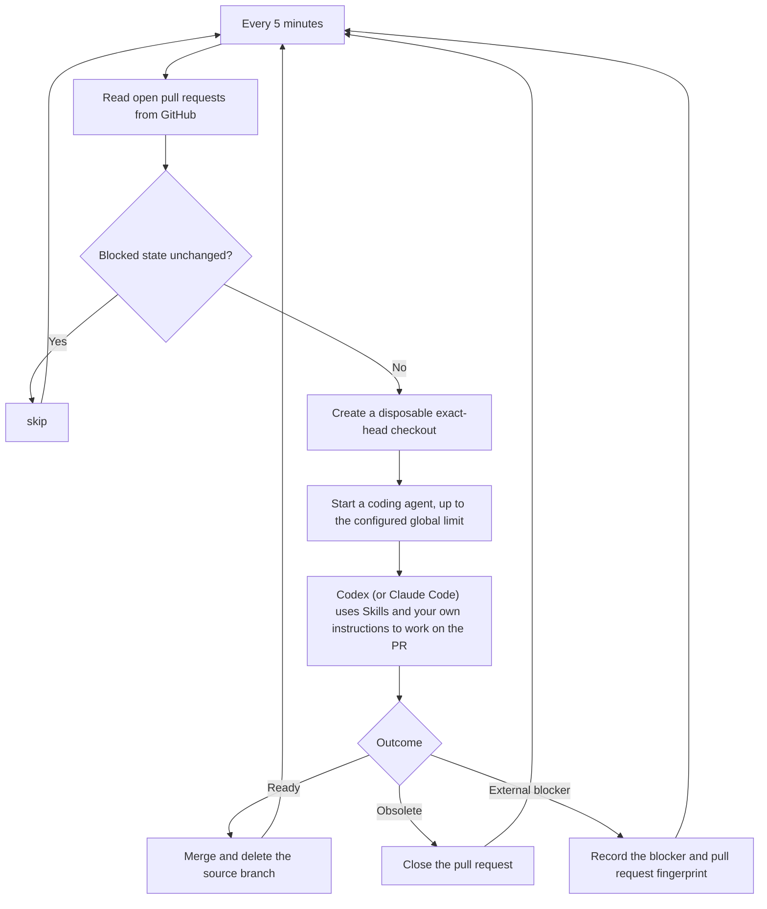

# Babysitter

Babysitter is a [ViteHub](https://github.com/vite-hub/vitehub) agent that owns open pull requests across configured GitHub repositories until each one is merged, closed, or blocked. Every five minutes, it runs one globally bounded batch of coding agents.

## How it works



1. **Prepare pull requests.** The [schedule](server/babysitter.schedule.ts), built with ViteHub's [Schedule primitive](https://vitehub.dev/docs/server-primitives/schedule), reads up to 100 open pull requests from each configured GitHub repository. Each selected pull request gets a disposable checkout verified against the observed head SHA, so one run cannot inspect one revision while editing another.
2. **Run pull requests in parallel.** One awaited batch applies a single concurrency limit across every repository. ViteHub's process schedule runtime serializes schedule occurrences, so a later five-minute occurrence cannot overlap the active batch. Each agent also receives a private [Box](https://vitehub.dev/docs/agents/boxes) Home containing only the declared GitHub and coding-agent credentials.
3. **Work toward a terminal outcome.** The [agent prompt](server/agents/babysitter/prompt.template.md) and colocated [Skills](https://vitehub.dev/docs/capabilities/skills) tell the coding agent to validate the requested direction, bring the branch up to date with its base, address checks and review feedback, verify the exact head, and then merge or close the pull request. The agent may stop only for a real external blocker, such as a missing credential, unavailable service, or unresolved product decision.
4. **Retry only when useful.** A blocked pull request gets a completion fingerprint in [ViteHub KV](https://vitehub.dev/docs/server-primitives/kv). Later schedules skip it while its observed GitHub state is unchanged; a new commit, comment, check result, review, or metadata change updates the fingerprint and makes it eligible again. Failed, timed-out, or otherwise unfinished runs do not get that completion marker, so a later schedule retries them.

## Requirements

> [!WARNING]
> Babysitter uses your host and credentials to edit code, push branches, change pull requests, and merge them. Read the [agent prompt](server/agents/babysitter/prompt.template.md) before running it.

- Node.js 24 or newer
- Corepack, which activates Babysitter's pinned pnpm version
- `git` and a GitHub repository you want Babysitter to watch. Babysitter launches the owner in an exact-head checkout without installing the watched project's dependencies; adapt the [agent prompt](server/agents/babysitter/prompt.template.md) if the owner needs package-manager-specific setup.
- An authenticated [`gh`](https://cli.github.com/) CLI with permission to update that repository. This implementation uses `gh` directly to discover and inspect pull requests, so it is currently required.
- An authenticated coding-agent CLI. ViteHub [Agent Drivers](https://vitehub.dev/docs/agents/agent-drivers) support both Codex and Claude Code. [Codex](https://github.com/openai/codex) is recommended because its non-interactive `codex exec` command is designed for programmatic use; this repository uses Codex by default.

## Start Babysitter

1. Read and adapt the [agent prompt](server/agents/babysitter/prompt.template.md) so its permissions, review policy, and merge rules match your repository.

2. Install the dependencies and start Babysitter with repository names. `BABYSITTER_REPOS` accepts comma- or space-separated `OWNER/REPOSITORY` values, and `BABYSITTER_MAX_OWNERS` caps the global batch. The singular `BABYSITTER_REPO` remains supported and defaults to `vite-hub/vitehub` when the plural setting is empty.

   ```sh
   corepack enable
   pnpm install
   BABYSITTER_REPOS=OWNER/REPOSITORY,OWNER/ANOTHER_REPOSITORY \
   BABYSITTER_MAX_OWNERS=2 \
   pnpm dev
   ```

   To mirror invocation sessions and export completed OTLP traces to ViteHub Console, set its base URL and bearer token:

   ```sh
   VITEHUB_CONSOLE_URL=https://console.example \
   VITEHUB_CONSOLE_TOKEN=replace-me \
   pnpm dev
   ```

To use Claude Code instead, install `@ai-sdk/harness-claude-code`, then replace `codexDriver()` with `claudeCodeDriver()` in the [agent definition](server/agents/babysitter/agent.ts).
